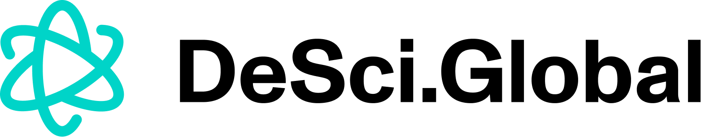

  
  <h1>Welcome 👋🌐🔬</h1>

This is the repo for the [desci.global](https://desci.global) website, a resource for the DeSci community. The purpose of the site is to _“Be the best overview of decentralized science events for our growing global community"_.

[desci.global](https://desci.global/) is kept up to date by community members who submit upcoming events. If you are interested to support, you can make a pull request here or submit a desci event via the website.

  <h1>How to add an event?</h1>

You can make a event submission on the website and email johannes[at]molecule.to if you have questions, or make a pull request on github if you want to improve the page. Desci.Global is a next.js (react) app with tailwind as CSS lib. To get the page working on your local machiene, you will need the airtable api key, email me at johannes@molecule.to and we will set you up in no time.

*Initiated and maintainted with love by the [Molecule team 💙](https://www.molecule.to/about-us)*

